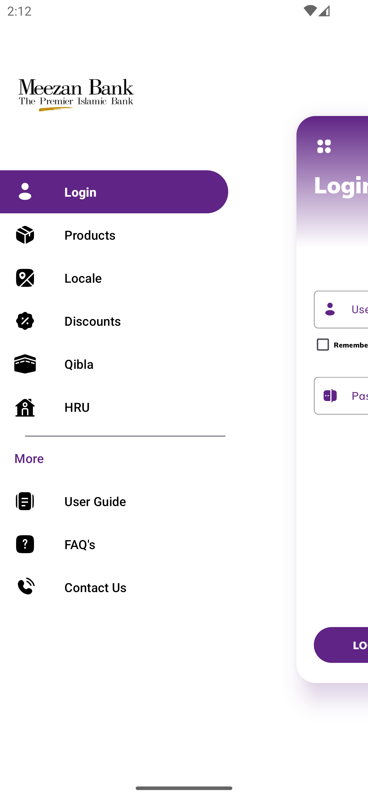
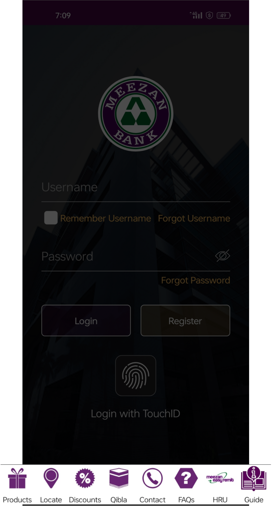
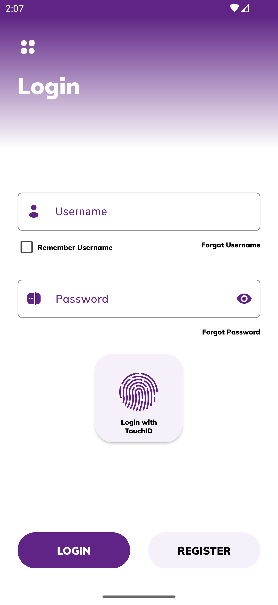
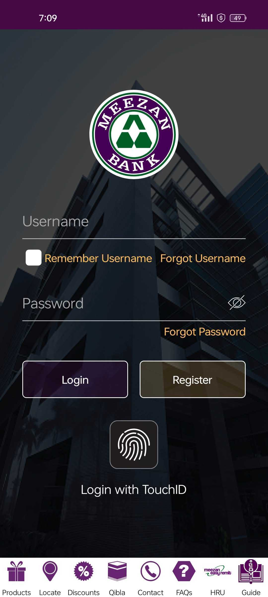
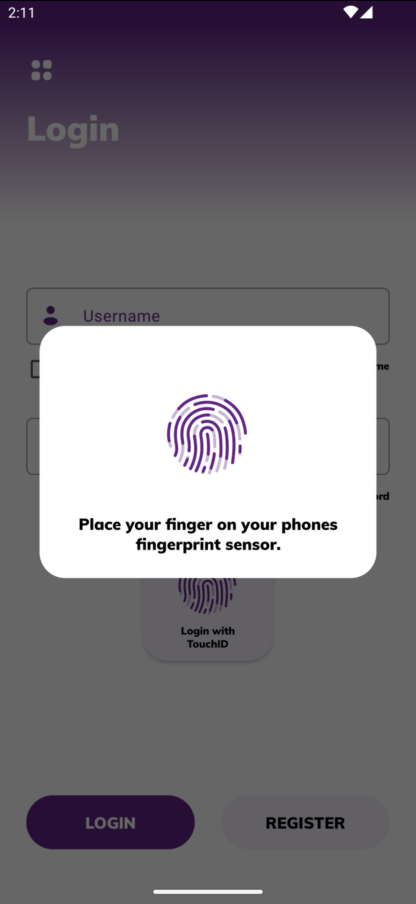
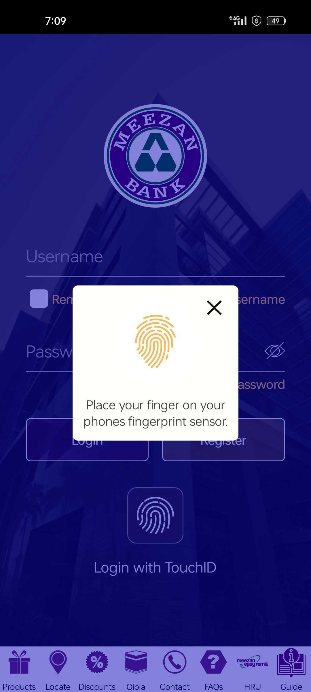
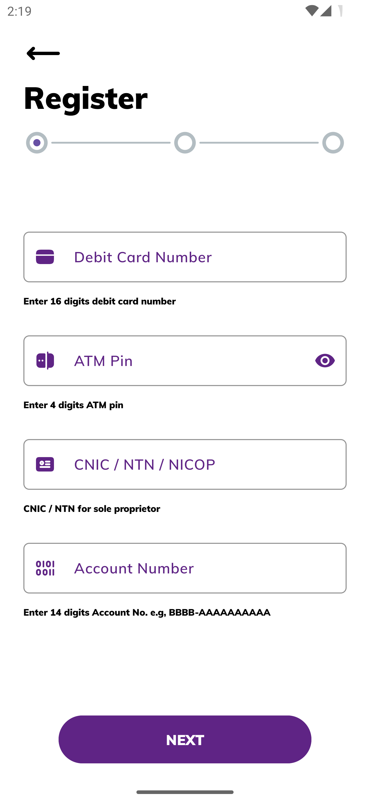
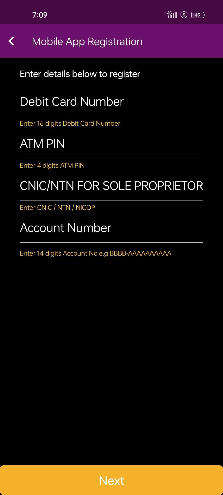
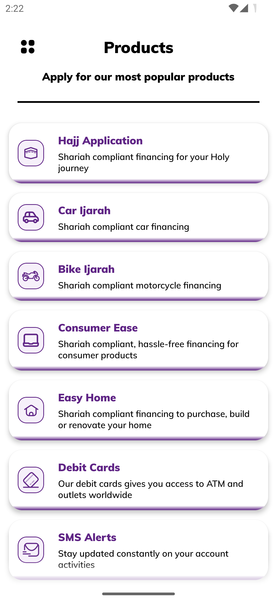
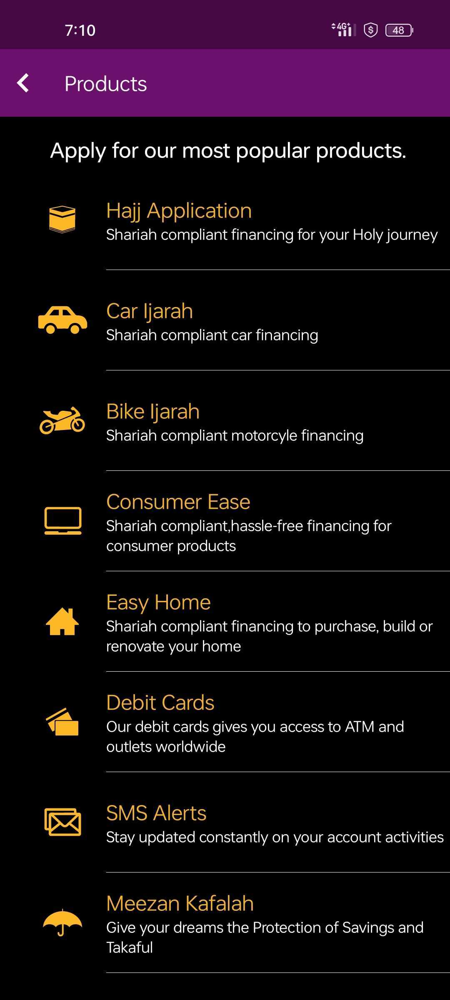

# MeezanBank-Revamped-Android

This project is a revamped UI of the old Meezan Bank app, providing a modern and enhanced user experience for the customers of Meezan Bank, Pakistan. The app incorporates various libraries for responsive design, navigation, animations, network operations, and more.

## Features

- **Responsive Design**: Ensures the app looks great on all screen sizes.
- **Modern UI Components**: Utilizes third-party libraries for enhanced UI elements.
- **Smooth Navigation**: Implements efficient navigation throughout the app.
- **Animations**: Integrates Lottie animations for a visually appealing interface.
- **Network Operations**: Uses Retrofit and OkHttp for efficient API calls.
- **Custom UI Elements**: Includes custom views like PinView, password strength meter, shimmer effects, and more.

## Libraries Used

### Responsive Design
- **sdp-android**: A scalable size unit to help with responsive design.
  ```groovy
  implementation 'com.intuit.sdp:sdp-android:1.1.0'
  ```

### UI Components
- **CircleImageView**: A circular ImageView for profile pictures.
  ```groovy
  implementation 'de.hdodenhof:circleimageview:3.1.0'
  ```
- **Lottie**: For adding animations to the app.
  ```groovy
  implementation "com.airbnb.android:lottie:6.0.0"
  ```
- **DotsIndicator**: For adding tab indicators.
  ```groovy
  implementation 'com.tbuonomo:dotsindicator:4.2'
  ```
- **PinView**: A custom view for inputting PINs.
  ```groovy
  implementation 'io.github.chaosleung:pinview:1.4.4'
  ```
- **Stepper Indicator**: For adding stepper indicators in view pagers.
  ```groovy
  implementation 'com.github.rakshakhegde:stepper-indicator:2.0.0-alpha'
  ```
- **Password Strength Meter**: For showing password strength.
  ```groovy
  implementation 'nu.aaro.gustav:passwordstrengthmeter:0.4'
  ```
- **Shimmer**: For adding shimmer effects to TextViews.
  ```groovy
  implementation 'com.romainpiel.shimmer:library:1.4.0@aar'
  ```
- **CaptchaImageView**: For implementing CAPTCHA.
  ```groovy
  implementation 'com.github.jineshfrancs:CaptchaImageView:1.0'
  ```

### Navigation
- **AndroidX Navigation**: For fragment navigation and UI.
  ```groovy
  implementation 'androidx.navigation:navigation-fragment-ktx:2.7.4'
  implementation 'androidx.navigation:navigation-ui-ktx:2.7.4'
  implementation 'androidx.navigation:navigation-common:2.7.4'
  ```

### State Management
- **Kotlin Coroutines**: For managing asynchronous operations.
  ```groovy
  implementation 'org.jetbrains.kotlinx:kotlinx-coroutines-core:1.7.3'
  implementation 'org.jetbrains.kotlinx:kotlinx-coroutines-android:1.7.3'
  ```

### Others
- **Activity KTX and Fragment KTX**: For easier management of activities and fragments.
  ```groovy
  implementation "androidx.activity:activity-ktx:1.8.0"
  implementation "androidx.fragment:fragment-ktx:1.6.1"
  ```

### Network Operations
- **OkHttp and Retrofit**: For making network requests and handling API calls.
  ```groovy
  implementation 'com.squareup.okhttp3:okhttp:4.10.0'
  implementation 'com.squareup.okhttp3:logging-interceptor:4.10.0'
  implementation 'com.squareup.retrofit2:retrofit:2.9.0'
  implementation 'com.squareup.retrofit2:converter-gson:2.9.0'
  ```

### Image Loading
- **Glide**: For loading and caching images.
  ```groovy
  implementation 'com.github.bumptech.glide:glide:4.15.0'
  annotationProcessor 'com.github.bumptech.glide:compiler:4.13.2'
  ```

### Splash Screen
- **AndroidX Core SplashScreen**: For implementing a splash screen.
  ```groovy
  implementation 'androidx.core:core-splashscreen:1.0.1'
  ```

## Screenshots

<table>
  <tr>
    <th>New Splash Screen</th>
    <th>Old Splash Screen</th>
    <th>New Menu Screen</th>
    <th>Old Menu Screen</th>
  </tr>
  <tr>
    <td align="center"></td>
    <td align="center"></td>
    <td align="center"></td>
    <td align="center"></td>
  </tr>
  <tr>
    <th>New Login Screen</th>
    <th>Old Login Screen</th>
    <th>New Login Fingerprint Screen</th>
    <th>Old Login Fingerprint Screen</th>
  </tr>
  <tr>
    <td align="center"></td>
    <td align="center"></td>
    <td align="center"></td>
    <td align="center"></td>
  </tr>
  <tr>
    <th>New Registration Screen</th>
    <th>Old Registration Screen</th>
    <th>New Product Screen</th>
    <th>Old Product Screen</th>
  </tr>
  <tr>
    <td align="center"></td>
    <td align="center"></td>
    <td align="center"></td>
    <td align="center"></td>
  </tr>
</table>

---

Feel free to customize this README.md file to better fit your project's specifics and additional features.

## Enjoy coding! 🎉
